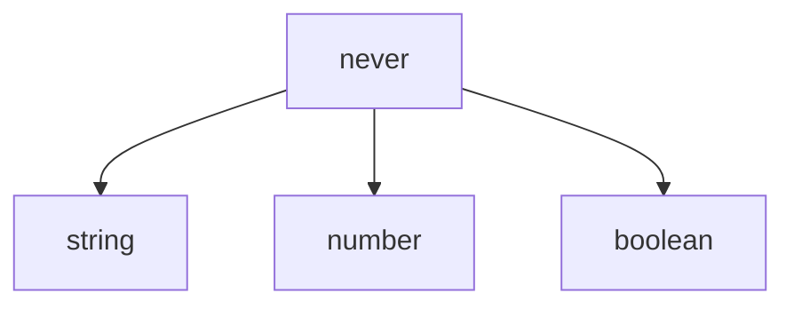
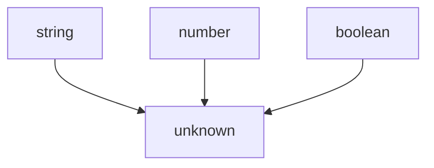
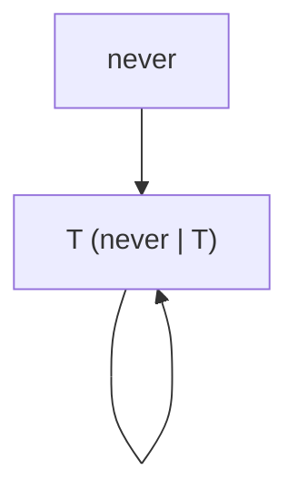
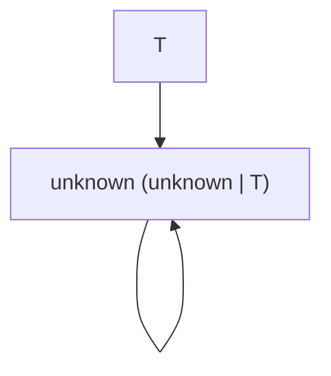
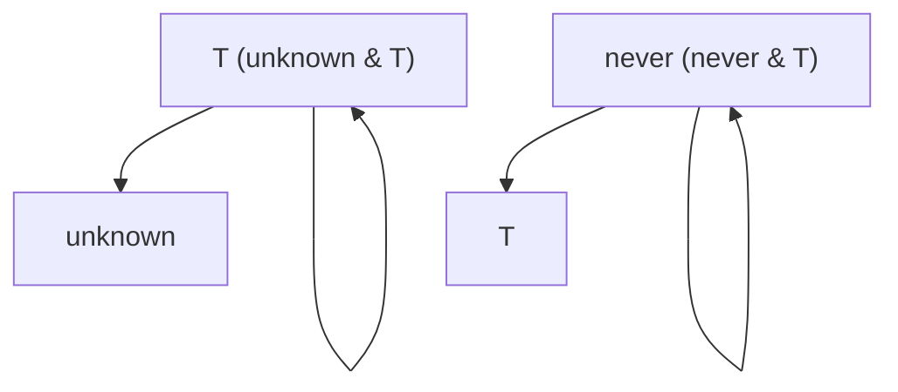

## はじめに
[先日公開した記事](https://zenn.dev/mshaka/articles/603aae9f141042)では、部分型関係を導きの糸として`keyof never`と`keyof unknown`の定義を説明しました。存外に多くの方に読まれ著者としては嬉しい限りです。味をしめた今回は、前回の記事でやり残した感のある`never`と`unknown`そのものの振る舞いについて補足を加えたいと思います。

具体的には、`never`と`unknown`の部分型関係における特殊な立ち位置について、図解を交えた解説を試みます。`never`は全ての型の部分型であり、`unknown`は全ての型の上位型です。この性質を理解すると、`|`と`&`に`never`や`unknown`を食わせたときの挙動も理解しやすくなります。また、distributive conditional typeにおける`never`の振る舞いも統一的な解釈が与えられることになります[^1]。
[^1]: 恥ずかしながらdistributive conditional typeにおける`never`の振る舞いは筆者も[最近になって知りました](https://x.com/schwmtl/status/1838938729496613351)。最初はバグを疑いましたが仕様通りの挙動でした。

なお、前回の記事は読まれていることを前提とさせていただきます。

## `never`と`unknown`の基本
### `never`
`never`はどんな型に対してもその部分型になります。つまり、以下のコードは問題のないコードです。

```typescript
function f(x: never) {
  const s: string = x
  const n: number = x
  const b: boolean = x
}
```

部分型関係は、代入可能性（assignability）とも呼ばれるのでした。`never`は`string`, `number`, `boolean`の部分型なので、`never`型の項はそれらの変数に代入可能です。もちろんこれらの型に限らず、どんな型の変数にも代入可能です。

ここで、今後の説明のために部分型関係を図で示すときの約束を定めましょう。矢印は部分型関係を表します。また、どんな型もそれ自体の部分型になりますが、説明に必要のない限りは省略します。



### `unknown`
`never`とは逆に、`unknown`は全ての型の上位型です。

```typescript
declare let x: unknown
x = 1
x = 'hello'
x = true
```

`string`, `number`, `boolean`は`unknown`の部分型になるので、`unknown`型の変数に代入可能です。図に表すと、さっきとは逆向きの矢印が生えています。



## `|`と`&`における`never`と`unknown`
前回の記事で、`A | B`を「`A`と`B`の上位型の中で一番小さい型」、`A & B`を「`A`と`B`の部分型の中で一番大きい型」と説明しました。だとすると、`never`や`unknown`が`|`と`&`に与えられるとどうなるでしょうか？実はこれも、上記で説明した性質から整合的に解釈可能です。

まず、`T`をなんらかの型としたとき、`never | T`（可換なので`T | never`でもよい）は`T`と等しいです。これは、`T`自体が自分自身の上位型かつ`never`の上位型だからです。



また、`unknown | T`は`unknown`です。`unknown`は全ての型の上位型なので、`unknown`は`T`と`unknown`の上位型で、それより小さい上位型はありません。



`T`に`never`や`unknown`自体が入ってもこの説明は整合的です。例えば、`never | never`は`never`であり、`never | unknown`は`unknown`です。

`&`についても、`never`と`unknown`, 部分型と上位型を相互に入れ替えることで説明できます。`unknown & T`は`T`です。`T`は自分自身の部分型で、`unknown`の部分型だからです。また、`never & T`は`never`になります。これはもう説明は不要でしょう。



綺麗に反転していますね。`never`と`unknown`、`|`と`&`が対となる概念なのが見てとれると思います。

## distributive conditional typeにおける`never`
最後に、distributive conditional typeにおける`never`の振る舞いについて触れておきます。distributive conditional typeとは、`M<T> = T extends U ? X : Y`のようなかたちの条件型のことです。`extends`の左辺が型パラメータ`T`そのものの場合、`T`にユニオン型が入ると特殊な挙動を示します。

ここで`M<string | number>`とすると、返ってくる型は`string extends U ? X : Y | number extends U ? X : Y`となります。つまり、ユニオンの各ブランチに対して条件型が適用したものを再度ユニオンするかたちになります。掛け算の分配法則のようなものです（$a(b + c) = a\cdot b + a\cdot c$）。

では、`M<never>`はどうでしょうか？実はこれは`never`となります。というのも、そうしないと辻褄が合わなくなるからです。`M<string | never>`について考えてみましょう。`string | never`は`string`なので、`M<string | never>`は`M<string>`と同じ型になって欲しいです。`string extends U ? X : Y | never extends U ? X : Y`と展開される`M<string | never>`が、`M<string>`、つまり`string extends U ? X : Y`に等しくなるためには、`never extends U ? X : Y`が`never`となる必要があります[^2]。よって、`M<never>`は`never`となるのです。$a(b + 0) = a\cdot b$となるのは、$a \cdot 0 = 0$だからなのと同様です。
[^2]: 本来は「どんな型`U`, `X`, `Y`についても」という但し書きがつきます。例えば、`M<T> = T extends string ? string : string`とした場合、`M<never>`が`never`でなくとも`M<string | never>`と`M<string>`はともに`string`になります。

## おわりに
以上、手短ではありましたが`never`と`unknown`についての補足でした。自分でこうやって説明してきて、TypeScriptの型システムは部分型関係を基礎概念にして理解するのが一番わかりやすいような気がしてきました。その点についてのご意見・ご感想お待ちしています。
